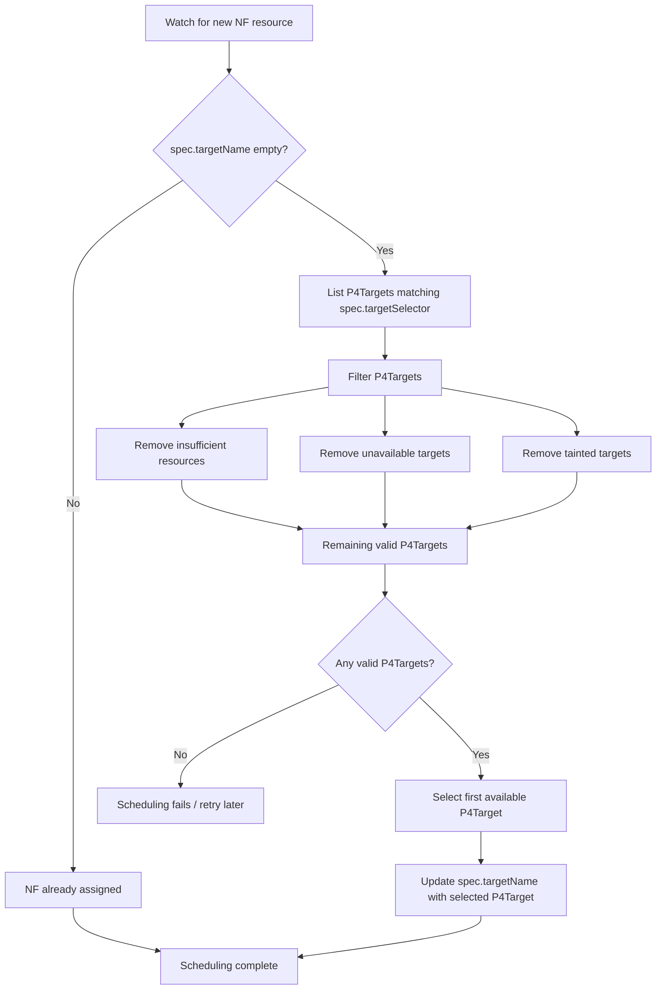

# Network Function Scheduling System

## Scheduling Process
The network function scheduling system is in charge of assigning network functions to available P4Targets.
It works very similarly to a Kubernetes scheduler but with NFs instead of pods and P4Targets instead of nodes:

- it watches for new NF resources and then checks if this NF is assigned to a specific node by verifying
  if its `spec.targetName` field is not empty.
- If it is empty, it then starts the scheduling process by lists all P4Targets matching its `spec.targetSelector` field.
- Once all matching P4Targets are listed, it filters out those that either do not have enough resources, are
  unavailable, or have existing taints that prevent scheduling.
- Finally, it selects the first available P4Target and assigns the NF to it by updating its `spec.targetName` field
  with the name of the selected P4Target. Ideally, the final scheduling decision should be based on a more complex
  algorithm that takes into account the current load of each P4Target, but in the current implementation, we simply
  select the first available one for simplicity.

Here is a diagram illustrating the scheduling process:

## Automatic scaling and restarts
Network functions are neither scaled or restarted automatically. In order to achieve this, we have added a 
`NetworkFunctionDeployment` resource that works almost exactly the same as a Kubernetes Deployment, but for network functions. 
This resource allows users to specify the desired number of replicas for a given NF, and the scheduling system 
will ensure that the specified number of NF instances are running at all times. If an NF instance fails or is deleted,
the scheduling system will automatically create a new instance to replace it, ensuring high availability and 
reliability for network functions deployed on the platform.

Underneath, `NetworkFunctionDeployments` use another resource named `NetworkFunctionReplicaSet`, which is responsible
for managing the lifecycle of individual NF instances. These NF ReplicaSets track the number of 
replicas specified in the NF Deployment and ensures that the desired number of NF instances are running
at all times. If an NF instance fails or is deleted, the NF ReplicaSet will automatically create a new
instance to replace it, ensuring high availability and reliability for network functions deployed on the platform.
`NetworkFunctionReplicaSets` however, are not meant to be used directly by users, but rather as an internal mechanism
to manage NF instances. This is because they don't update the replicas on spec changes, but instead this responsibility
is left to the NF Deployment, which is the resource that users interact with when they want to scale 
or modify their NFs.
