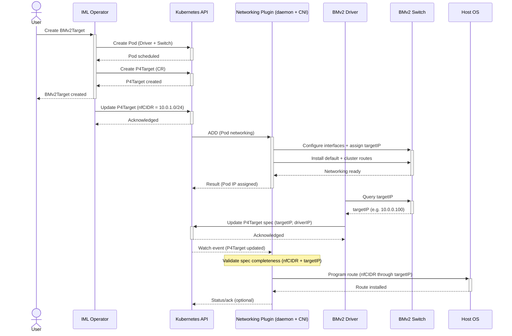

# P4Target Addon System
Programmable targets are a key component of the IML ecosystem, they allow developers to run custom network functions
and achieve seamless scheduling and acceleration. Underneath these targets, there is a flexible system that allows
vendors to support their own hardware and software as well as defining their own custom features 
such and optimizations, such as multi-tenancy support, additional data-plane objects, or custom telemetry. 

This system is what we call the P4Target addon system, and it is responsible for providing kubernetes-native resources
for:

- exposing status updates to the NF scheduling system, such as resource availability or NF deployment status,
- packaging and retrieving NF programs,
- specifying NF configurations or table entries,
- publishing data-plane objects and telemetry,
- and configuring networking, such as setting up routes or performing IP address management.

## P4Target drivers
P4Target drivers play a core part of the addon system. They are Kubernetes-aware controllers that are responsible for
interacting with both the IML platform and the underlying hardware or software target. They watch for changes **in the
Kubernetes resources** and then translate them into actions on the target, such as deploying a new NF program, 
updating table entries, or removing a NF whose kubernetes resource was deleted. They also watch for **changes 
on the target**, such as failed deployments, telemetry updates, or changes in the target's availability, 
and then update the corresponding Kubernetes resources to reflect the current state of the target.


Each P4Target driver is responsible for a specific type of target, such as a specific hardware switch, a software
switch, or any other kind of programmable target. As a result of this, each driver can define its own custom resources
or features to support the specific capabilities of its target, while still adhering to a common interface that allows
the IML platform to interact with it in a consistent manner.

## Exposing status updates
Each P4Target driver is responsible for exposing status updates to the NF scheduling system for both itself and the NFs
assigned to it. For the NFs, this includes information such as whether the NF is currently deployed on the target, if 
there were any errors during deployment, or if the NF is currently running or not. For the target itself, this includes
information such as its current resource availability, whether it is currently available for scheduling new NFs, or if
there are any issues that might affect the performance of the NFs running on it.

The status updates for the NFs are published in the `status` field of the corresponding `NetworkFunction` resource, 
while the status updates for the target are published in the `status` field of the corresponding `P4Target` resource.
This way, the NF scheduling system can easily access this information and use it to make informed scheduling decisions,
while users can also query for this information to monitor the status of their NFs and targets.

## Packaging and retrieving NF programs
In each Network Function resource, users must specify a url for the code of the NF program they want to run on 
the target by using the `spec.p4code` field. The P4Target driver is responsible for retrieving the NF program from the 
specified url and then deploying it on the target.

To retrieve all NF programs assigned to a specific target, the P4Target driver can use Kubernetes' API to watch for 
all Network Function resources with a `spec.targetName` field matching the name of its target. Whenever a new NF
is assigned to the target, the driver retrieves its NF program from the specified url and deploys it on the target.
If an NF is removed from the target, either by deleting it or by changing its `spec.targetName` field, the driver 
is responsible for removing the corresponding NF program from the target.

## Configuring NFs
While some network functions can run without any additional configuration, many of them require some kind of
configuration to work properly. In P4, these configurations are usually done by populating tables with specific
entries, and the P4Target addon system provides a flexible way to specify these table entries through the use of 
the `NetworkFunctionConfig` resource. This resource allows users to specify a set of table entries that should be 
applied to a specific NF, and the P4Target driver is responsible for translating these entries into the appropriate
format for the target and then applying them.

In order to link a `NetworkFunction` resource to a specific NF Config, users can use the `spec.configRef` field to 
specify the name of the config they want to use. The P4Target driver then watches for changes in both the NF and the
NFConfig resources, and whenever it detects a change in a referenced config, it updates the specified table entries 
to the corresponding NF on the target. If the NetworkFunctionConfig is deleted, the driver is responsible for removing
the corresponding table entries from the target as well.

```yaml
apiVersion: core.loom.io/v1alpha1
kind: NetworkFunction
metadata:
  name: my-nf
spec:
  p4File: https://my-repo.com/my-nf.p4
  configRef:
    name: my-nf-config
---
apiVersion: core.loom.io/v1alpha1
kind: NetworkFunctionConfig
metadata:
  name: my-nf-config
spec:
  tables:
    my_table:
      entries:
        - matchFields:
            - name: hdr.ethernet.srcAddr
              type: Exact
              exact:
                macAddress: 00:11:22:33:44:55
          action:
            name: MyIngress.my_action
            parameters:
              - name: param1
                int: "42" # This field NEEDS to be a string to support arbitrary precision integers.
```

## Publishing data-plane objects and telemetry
Data-plane objects such as counters, meters, or registers are commonly used in P4 programs to store state 
or collect telemetry information. Unlike configurations or NF programs, these object cannot be configured directly 
by the user. Instead, they are updated by the program itself while it is running on the target, as a result
of this, they are in constant change. The Kubernetes API is not designed to handle this kind of rapidly changing data, 
so instead of using Kubernetes resources to represent these data-plane objects, these objects must be published 
through the `/objects` endpoint on the driver. Additionally, the values of some these data-plane objects can be
published as metrics by the P4Target driver, which then can be scraped by Prometheus or any other monitoring tool.

## Configuring networking
To allow NFs to communicate with each other and with external applications, the P4Target addon system also provides
a way to configure networking on the target through the use of the `P4Target` resource. This resource includes
three fields related to network configuration:

- `spec.driverIPs`
- `spec.targetIP`
- `spec.nfCIDR`

The `spec.driverIPs` field is used to specify the IP addresses of the driver, meaning the IP addresses that were 
assigned by the primary CNI, and that regular pods that haven't been configured with IML's CNI can use to communicate
with the driver to extract data-plane object state or to perform any other necessary interactions. There can be 
multiple driver IPs specified in this field for dual stack support. The driver is responsible for publishing these
IP addresses in the `spec.driverIPs` field of the `P4Target` resource, so users can easily retrieve this information.

The `spec.targetIP` field is used to specify the IP address that IML `Applications` can use to reach the target and
its NFs. This IP address is used for service chaining and traffic steering. The driver is responsible for publishing 
this address in the `spec.targetIP` field of the `P4Target` resource, so that the networking plugin can then retrieve
this information and use it to configure the necessary routes and steering rules.

Finally, the `spec.nfCIDR` field specifies the CIDR that the target can use to assign IP addresses to the NFs running
on it. This allows the target to have complete control over IP address management of the NFs. This field automatically
set by the IML operator whenever it detects that it is empty. If the `spec.targetCIDR` field is not empty, then IML's
operator assumes that either a CIDR was already assigned by itself or that a custom CIDR was specified by the user, 
and in both cases, it does not modify this field.

Here is an example sequence diagram illustrating how the network configuration process of a BMv2Target switch works:

