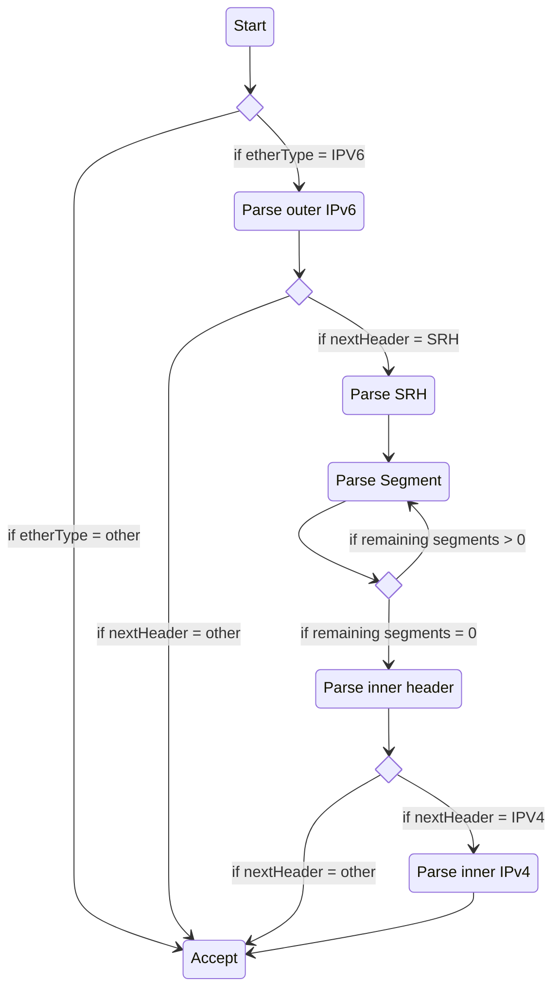

# Creating and deploying a Network Function
Network Functions (NFs) are the core building blocks of any service chain. 
They are responsible for processing and manipulating network traffic as it flows through the service chain. 
In this section, we will create and deploy a simple firewall network function that will be used 
in the following sections to filter traffic between a web client and a web server.

## Creating the firewall NF in P4
P4 is a domain-specific language for creating programmable data planes. It allows you to define how packets are 
processed and manipulated as they flow through the network.

Every P4 program consists of a few key components:

 - **Headers**: define the structure of the packet headers that the program will parse and manipulate.
 - **Parsers**: define how the program will parse incoming packets and extract header fields.
 - **Tables**: define the match-action tables that will be used to process packets based on their header fields.
 - **Actions**: define the actions that will be taken on packets that match certain criteria in the tables.
 - **Control flow**: define the order in which the tables and actions will be executed.

### Libraries
Every P4 program starts by importing the necessary libraries for our P4 program. We will be using the `core.p4` library 
for basic P4 constructs and the `v1model.p4` library for the v1model architecture, which is a common 
architecture for software switches like BMv2.
```c++
#include <core.p4>
#include <v1model.p4>
```

### Headers
Moving on, every P4 program needs to define the headers that it will be parsing and manipulating from the packets.
This usually depends on the type of traffic that our applications generate and consume. 

In IML, every packet will have:

 - **an Ethernet header**, 
 - an **outer IPv6 header**, 
 - a **Segment Routing Header (SRH) for SRv6**, 
 - and **an inner IP header** (IPv4 or IPv6) that contains the original packet from the source application.

As such, our P4 program needs to define the structure of these headers in order to be able to parse and manipulate them.
Here is an example of how these headers can be defined in P4:
```c++
header ethernet_h {
    bit<48> dstAddr;
    bit<48> srcAddr;
    bit<16> etherType;
}

header ipv6_h {
    bit<4>  version;
    bit<8>  traffic_class;
    bit<20> flow_label;
    bit<16> payload_len;
    bit<8>  next_hdr;
    bit<8>  hop_limit;
    bit<128> src_addr;
    bit<128> dst_addr;
}

header srv6_h {
    bit<8> next_hdr;
    bit<8> hdr_ext_len;
    bit<8> routing_type;
    bit<8> segments_left;
    bit<8> last_entry;
    bit<8> flags;
    bit<16> tag;
}

header segment_h {
    bit<128> segment;
}

struct headers {
    ethernet_h ethernet;
    ipv6_h outer_ipv6;
    srv6_h srh;
    segment_h[MAX_SEGMENTS] segment_list;
    ipv6_h inner_ipv6;
}
```

### Metadata
In addition to headers, P4 programs can also define metadata, which is used to store information 
about the packet that is not part of the packet headers. This might sound a bit abstract, but you can imagine
metadata as a scratch space that the P4 program can use to store information about the packet as it is being processed.
This information can then be used later in the program to make decisions about how to process the packet.

In our firewall example, we will define a simple metadata structure that contains an 8 bit field to indicate
whether the packet is allowed or not:
```c++
struct metadata {
    bool allowed;
}
```

### Parsers
Parsers are used to define how the P4 program will parse incoming packets and extract header fields. 
In our example, we will define a simple parser that will parse the Ethernet, IPv6, SRH, and inner 
IPv4 headers from the incoming packets. This parser can be defined as a finite state machine, where each state
corresponds to a header that we want to parse. The parser will transition from one state to the next based on the 
values of the header fields that it extracts. Here's a diagram to illustrate this parser:


Here is the code of this parser in P4:
```c++
parser MyParser(packet_in packet,
                out headers hdr,
                inout metadata_t meta,
                inout standard_metadata_t stdmeta) {
    state start {
        packet.extract(hdr.ethernet);
        transition select(hdr.ethernet.etherType) {
            IPV6_ETHERTYPE: parse_outer_ipv6;
            default: accept;
        }
    }

    state parse_outer_ipv6 {
        packet.extract(hdr.outer_ipv6);
        transition select(hdr.outer_ipv6.next_hdr) {
            IPV6_NEXT_HEADER_ROUTING: parse_srh;
            default: accept;
        }
    }

    state parse_srh {
        packet.extract(hdr.srh);
        transition parse_srh_segments;
    }

    state parse_srh_segments {
        packet.extract(hdr.segment_list.next);
        transition select(hdr.segment_list.lastIndex < (bit<32>)hdr.srh.last_entry) {
            true: parse_srh_segments; // Loop to extract all segments
            false: parse_inner_header;
        }
    }
    
    state parse_inner_header {
        transition select(hdr.srh.next_hdr) {
            IPV4_NEXT_HEADER: parse_inner_ipv4;
            default: accept;
        }
    }
    
    state parse_inner_ipv4 {
        packet.extract(hdr.inner_ipv4);
        transition accept;
    }
}
```

### Tables and Actions
Tables and actions are used to define the match-action logic of the P4 program. 
 - Tables are used to match on specific header fields and execute actions based on those matches. 
 - Actions could be considered as the functions that are executed when a packet matches a certain criteria in the table.
    
In our firewall example, we will define a simple table that matches on the destination IP address of the inner IPv4 
header and an action that sets the `allowed` metadata field to `true` if the destination IP address is allowed,
and `false` otherwise.

Here's how we can define this table and action in P4:
```c++
  action allow() {
      meta.allowed = true;
  }
  
  action deny() {
      meta.allowed = false;
  }

  table firewall_table {
    key = {
        hdr.inner_ipv4.dst_addr: exact;
    }
    actions = {
        allow;
        deny;
    }
    default_action = deny;
    size = 1024;
  }
```

### Control Flow
Finally, we need to define the control flow of the P4 program, which determines the 
order in which the tables and actions are executed.

In our firewall example, we will define a simple control flow that applies the firewall table to the packets 
after they have been parsed. If the packet is allowed, we will forward it to the next hop. 
If it is denied, we will drop it.

Here's how we can define this control flow in P4:
```c++
control MyIngress(inout headers hdr,
                  inout metadata_t meta,
                  inout standard_metadata_t stdmeta) {
  # Previous tables and actions
  # action allow() { ... }
  # action deny() { ... }
  # table firewall_table { ... }
  
  # Apply the firewall table to the packets
  apply {
    if (!hdr.outer_ipv6.isValid()) {
      return; // If the outer IPv6 header is not valid, skip processing}
    }
    if (!hdr.srh.isValid()) {
      return; // If the SRH header is not valid, skip processing
    }
    if (!hdr.inner_ipv4.isValid()) {
      return // If the inner IPv4 header is not valid, skip processing
    }
    // Here we're sure that the packet has all the necessary headers, so we can apply the firewall table
    firewall_table.apply();
    if (meta.allowed) {
      // If the packet is allowed, forward it to the next hop
      srv6_forward(); // The actual implementation of this function can be found in the finished program below, but it essentially updates the SRH and forwards the packet to the next hop
    } else {
      // If the packet is denied, drop it
      drop();
    }
  }
}
```

### Finished result
Putting everything together, the complete P4 program for our simple firewall network function would look like this:
```c++
#include <core.p4>
#include <v1model.p4>

#define MAX_SEGMENTS 8

const bit<16> IPV6_ETHERTYPE = 0x86DD;
const bit<8> IPV6_NEXT_HEADER_ROUTING = 43;
const bit<8> IPV4_NEXT_HEADER = 4;

header ethernet_h {
  bit<48> dstAddr;
  bit<48> srcAddr;
  bit<16> etherType;
}

header ipv6_h {
  bit<4>  version;
  bit<8>  traffic_class;
  bit<20> flow_label;
  bit<16> payload_len;
  bit<8>  next_hdr;
  bit<8>  hop_limit;
  bit<128> src_addr;
  bit<128> dst_addr;
}

header ipv6_h {
  bit<4>  version;
  bit<8>  traffic_class;
  bit<20> flow_label;
  bit<16> payload_len;
  bit<8>  next_hdr;
  bit<8>  hop_limit;
  bit<128> src_addr;
  bit<128> dst_addr;
}

header srv6_h {
  bit<8> next_hdr;
  bit<8> hdr_ext_len;
  bit<8> routing_type;
  bit<8> segments_left;
  bit<8> last_entry;
  bit<8> flags;
  bit<16> tag;
}

header segment_h {
  bit<128> segment;
}

struct metadata_t {
  bool allowed;
}

struct headers {
  ethernet_h ethernet;
  ipv6_h outer_ipv6;
  srv6_h srh;
  segment_h[MAX_SEGMENTS] segment_list;
  ipv6_h inner_ipv6;
}

parser MyParser(packet_in packet,
                out headers hdr,
                inout metadata_t meta,
                inout standard_metadata_t stdmeta) {
  state start {
    packet.extract(hdr.ethernet);
    transition select(hdr.ethernet.etherType) {
        IPV6_ETHERTYPE: parse_outer_ipv6;
        default: accept;
    }
  }

  state parse_outer_ipv6 {
    packet.extract(hdr.outer_ipv6);
    transition select(hdr.outer_ipv6.next_hdr) {
        IPV6_NEXT_HEADER_ROUTING: parse_srh;
        default: accept;
    }
  }

  state parse_srh {
    packet.extract(hdr.srh);
    transition parse_srh_segments;
  }

  state parse_srh_segments {
    packet.extract(hdr.segment_list.next);
    transition select(hdr.segment_list.lastIndex < (bit<32>)hdr.srh.last_entry) {
        true: parse_srh_segments; // Loop to extract all segments
        false: parse_inner_header;
    }
  }
  
  state parse_inner_header {
    transition select(hdr.srh.next_hdr) {
      IPV4_NEXT_HEADER: parse_inner_ipv4;
      default: accept;
    }
  }
  
  state parse_inner_ipv4 {
      packet.extract(hdr.inner_ipv4);
      transition accept;
  }
}

control MyVerifyChecksum(inout headers hdr, inout metadata_t meta) {
    apply { }
}

control MyIngress(inout headers hdr,
                  inout metadata_t meta,
                  inout standard_metadata_t stdmeta) {
  action allow() {
    meta.allowed = true;
  }
  
  action deny() {
    meta.allowed = false;
  }
  
  action drop() {
    mark_to_drop(stdmeta);
  }
  
  action srv6_forward() {
    // Apply the "End" SRv6 behavior
    if (hdr.srh.segments_left > 0) {
        hdr.srh.segments_left = hdr.srh.segments_left - 1;
        hdr.outer_ipv6.dst_addr = hdr.segment_list[hdr.srh.segments_left].segment;
    } else {
        mark_to_drop(stdmeta);
    }

    // Change the source and destination MAC addresses
    bit<48> original_src = hdr.ethernet.srcAddr;
    hdr.ethernet.srcAddr = hdr.ethernet.dstAddr;
    hdr.ethernet.dstAddr = original_src;

    // Output the packet on the same port it came in on
    stdmeta.egress_spec = stdmeta.ingress_port;
  }

  table firewall_table {
    key = {
        hdr.inner_ipv4.dst_addr: exact;
    }
    actions = {
        allow;
        deny;
    }
    default_action = deny;
    size = 1024;
  }

  apply {
    if (!hdr.outer_ipv6.isValid()) {
      return; // If the outer IPv6 header is not valid, skip processing}
    }
    if (!hdr.srh.isValid()) {
      return; // If the SRH header is not valid, skip processing
    }
    if (!hdr.inner_ipv4.isValid()) {
      return // If the inner IPv4 header is not valid, skip processing
    }
    // Here we're sure that the packet has all the necessary headers, so we can apply the firewall table
    firewall_table.apply();
    if (meta.allowed) {
      // If the packet is allowed, forward it to the next hop
      srv6_forward(); // The actual implementation of this function can be found in the finished program below, but it essentially updates the SRH and forwards the packet to the next hop
    } else {
      // If the packet is denied, drop it
      drop();
    }
  }
}

control MyEgress(inout headers hdr,
                 inout metadata_t meta,
                 inout standard_metadata_t stdmeta) {
    apply { }
}

control MyComputeChecksum(inout headers hdr, inout metadata_t meta) {
    apply { }
}

control MyDeparser(packet_out packet, in headers hdr) {
    apply {
        packet.emit(hdr.ethernet);
        packet.emit(hdr.outer_ipv6);
        packet.emit(hdr.srh);
        packet.emit(hdr.segment_list);
        packet.emit(hdr.inner_ipv6);
    }
}

V1Switch(
    MyParser(),
    MyVerifyChecksum(),
    MyIngress(),
    MyEgress(),
    MyComputeChecksum(),
    MyDeparser()
) main;

```

## Deploying the NF
Once you have your P4 program ready, and you have uploaded it somewhere accessible (e.g. a Git repository, 
a web server, an S3 bucket, etc.), you can deploy it by creating a `NetworkFunction` resource 
that references the P4 program.

To create a Network Function, you can use the following manifest:
```yaml
apiVersion: core.loom.io/v1alpha1
kind: NetworkFunction
metadata:
  name: example-firewall
  labels:
    nf: firewall
spec:
  p4File: https://example.org/firewall.p4
  targetSelector:
    matchLabels:
      p4target.loom.io/arch: v1model
```
