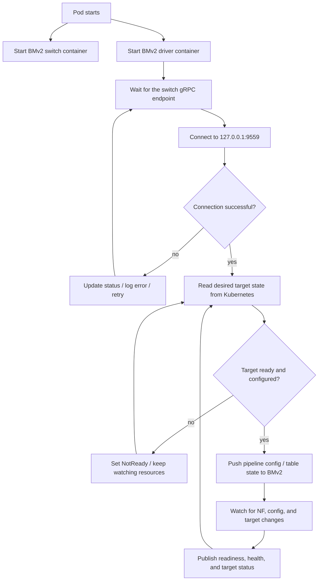

# BMv2 target driver

This directory contains a local-development image for the BMv2 programmable target driver and a sample pod manifest that runs the driver together with a BMv2 switch in the same pod.

Structures as follows:

- the **driver container** runs the control loop that talks to Kubernetes and to the switch,
- the **switch container** runs `simple_switch_grpc`,
- both containers share the same pod network namespace, so the driver can reach the switch on `127.0.0.1:9559`.

## What the main driver loop should look like

The driver is expected to behave like a reconciliation loop:



At a high level, the driver should repeatedly:

1. wait for the switch to be reachable,
2. establish the P4Runtime connection,
3. reconcile the current Kubernetes state into the target,
4. update status and readiness,
5. keep watching for changes and re-run the loop when the desired state changes.

## Files in this folder

- `Dockerfile` - builds the local BMv2 driver image.
- `Makefile` - builds the image, loads it into kind, and applies the test pod.
- `test.yaml` - sample pod manifest with the driver and BMv2 switch containers.

## Build the driver image locally

The default image name is `bmv2-driver:local`.

```bash
make docker-build
```

If you want to choose a different tag, override `IMG`:

```bash
make docker-build IMG=myrepo/bmv2-driver:dev
```

## Create a kind cluster

This example is meant for a local kind cluster.

```bash
make kind-create
```

If you already have a kind cluster and want to use a different name, set `KIND_CLUSTER` accordingly before loading the image.

## Load the image into kind

After building the image locally, load it into the kind cluster so Kubernetes can use it without pulling from a registry.

```bash
make kind-load
```

If you used a different cluster name, pass it to the Makefile:

```bash
make kind-load KIND_CLUSTER=my-kind-cluster
```

## Deploy the BMv2 pod

The sample manifest in `test.yaml` starts two containers in one pod:

- `bmv2-driver` - the local driver image you built,
- `bmv2-switch` - `p4lang/behavioral-model:latest`, started as `simple_switch_grpc`.

The switch listens on `127.0.0.1:9559`, which the driver can also reach through `127.0.0.1:9559` because both containers share the pod network namespace.

Apply the manifest with the Makefile helper:

```bash
make test-up
```

## Verify the pod

```bash
kubectl get pods -w
kubectl describe pod bmv2-test
kubectl logs pod/bmv2-test -c bmv2-switch -f
kubectl logs pod/bmv2-test -c bmv2-driver -f
```

If the driver is able to connect to the switch, it should continue into its reconciliation loop and start reporting readiness/state.

## Cleanup

Delete the pod and optionally remove the local image:

```bash
make test-down
docker rmi bmv2-driver:local
```

If you want to delete the kind cluster as well:

```bash
make delete-kind
```

## Notes

- The local build flow intentionally uses a `:local` tag so it matches the kind loading workflow used throughout the rest of the repository.

